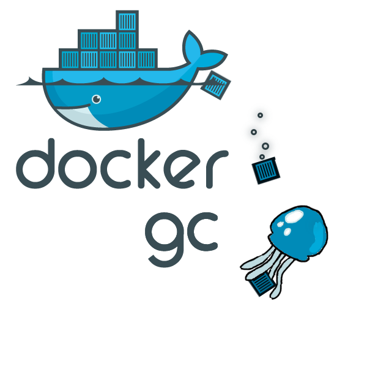

# Docker Garbage Collector

## Introduction

Docker is cool, but the way it manage container images has a side effect : after you destroyed a container, the image it has been built on
remains. In many cases, this results in a growing `/var/lib/docker` directory as you get new images (or image updates) running on your
docker host.

Docker-gc is a garbage collector process, which will remove obsolete docker images from your host, without impacting the running containers.

## Design

*Docker-gc* is a resident process, listening on docker daemon events for `container destroyed` events. This event is used to determine last used
of underlying image. When an image isn't used by any container, and last use is older than gc limit, the image is removed.
  
## Usage
  
run `docker-gc` to automatically purge unused images after 2 days. Default max age is 72 hours, so your docker images will survice a 
week-end. You can override with `--maxAge [duration]` using Golang duration syntax, for sample `--maxAge 60m` 

For your convenience, docker-gc is also available as a docker image. You can run it as `docker run -d -v /var/run/docker.sock:/var/run/docker.sock ndeloof/docker-gc`
You need to bind mount `/var/run/docker.sock` from docker host so the docker-gc process can attach to the daemon to listen for event and inspect/remove images.

You can also use `docker-gc.service` to deploy Docker-gc everywhere using [Fleet](https://coreos.com/fleet/docs/latest/) on a CoreOS cluster. Just run `fleetctl start docker-gc.service`.

## Note

once https://github.com/moby/moby/issues/4237 has been addressed, docker-gc could be significantly simplified.